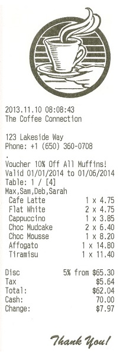
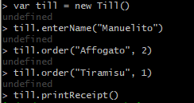
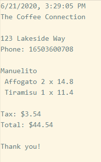

# Till tech test

This is a practice tech test I did during Week 10 at Makers Academy.

## Specification

We want to sell tills to a local hipster coffee shop who are finally embracing the 21st century. We need a new till to replace their vintage machines - unfortunately, hipster staff are too cool to learn a new system, so we need you to build something that they will understand.
This is what a sample receipt looks like:



Implement a system that contains the business logic to produce receipts similar to this, based on a `json` price list and test orders. A sample `.json` file has been provided with the list of products sold at this particular coffee shop.

Here are some sample orders you can try - whether you use this information is up to you:

> Jane
> 2 x Cafe Latte
> 1 x Choc Mudcake
>
> John
> 4 x Americano
> 2 x Tiramisu
> 5 x Blueberry Muffin

Your receipt must calculate and show the correct amount of tax (in this shop's case, 8.64%), as well as correct line totals and total amount. Do not worry about calculating discounts or change yet. Consider what output formats may be suitable.

## Extended version

* Add functionality to take payment and calculate correct change.
* Add functionality to handle discounts - in this example, a 5% discount on orders over $50, and a 10% muffin discount.
* Implement a user interface that can actually be used as a till. You may use whatever technologies you see fit.

## My approach

I used Node.js because I wanted to be able to read from the json file, and write into file, thus creating the receipt. I also used Jasmine for testing.  
The program calculates correct line totals, tax and total.
I used `fs` to write into file with Node.
Currently I'm using 1 class, the Till class, and its functions: `enterName`, `order`, `printReceipt`, and private functions. This class has a little bit too much responsibility and I plan to use an additional class for creating new lines of items on the same order, and also refactor the `printReceipt` function.

Some of the functionalities that need to be implemented:
* using 2 fixed point notation for all amounts
* format the phone number
* format the date (however this may be a limitation in Node.js)
* aligning the lines of items
* extra: calculate discount
* extra: calculate cash and change

## How to use

The tests can be run from the console:
```
cd tillTechTest2
jasmine
```

The program can be used in the Node REPL, by typing into the console:
```
cd lib
node
.load Till.js
```
After this a new till can be created, customer name entered, order placed and the receipt printed, like so:



And the last command will produce a receipt in the `lib/receipt.txt` file, like this:


